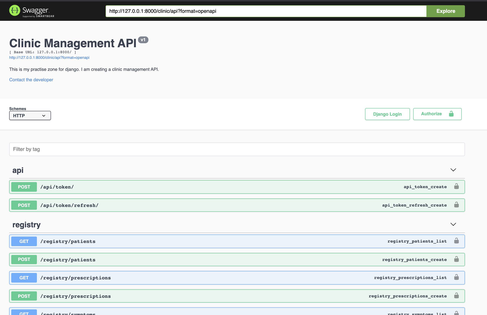

# clinic_management_api_2

This is the second version of clinic management API. Here I implement user authentication using Simple JWT.

## WHAT I LEARNT

- Working with relationships in django rest framework (This took me alot of time to serialize)
- Implementing the endpoints in Swagger
- Using JWT for authentication

## Resources

- Swagger view - <https://github.com/axnsan12/drf-yasg>
- Relationships - <https://www.youtube.com/watch?v=NCBxyw6rDds&ab_channel=CodeEnvironment>

## The look of the API in Swagger

